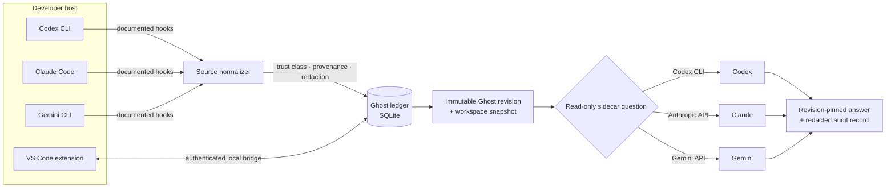
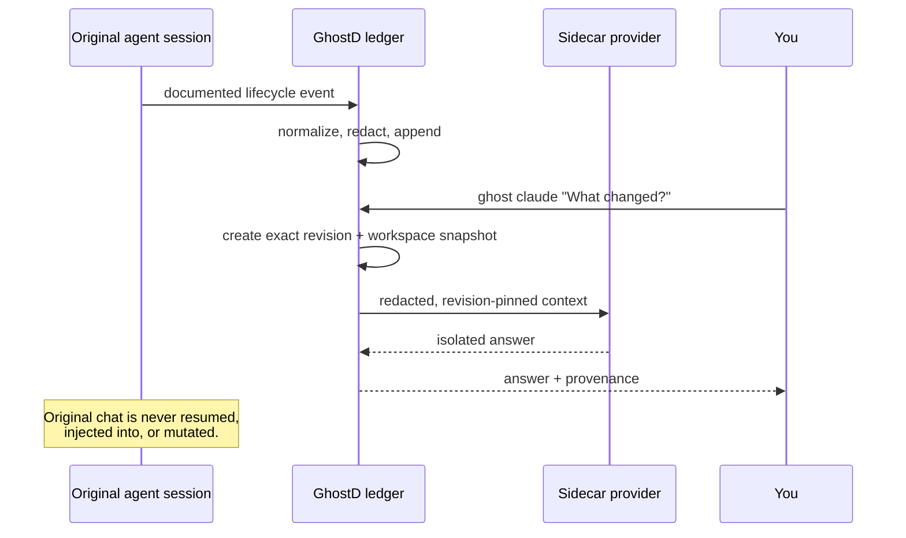
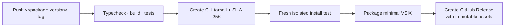

# 👻 GhostD

> **Portable, revision-pinned context for developer-agent workflows.**

<p align="center">
  
</p>

[](https://github.com/NimaJafariComp/GhostD/actions/workflows/release-verify.yml)
[](https://nodejs.org/)
[](https://www.typescriptlang.org/)
[](LICENSE)

GhostD is a local-first runtime that captures **documented** agent lifecycle events, compiles a redacted canonical context ledger, and lets you ask a revision-pinned sidecar question without cluttering or mutating the original Codex, Claude, or Gemini conversation.

```sh
# In a workspace with a selected captured session
ghost codex "What is true right now?"
ghost claude "Review the current approach for risk."
ghost gemini "Suggest edge cases we have missed."
```

<p align="center">
  <a href="#quick-start">Quick start</a> ·
  <a href="#how-it-works">How it works</a> ·
  <a href="#host-support">Host support</a> ·
  <a href="#install-and-release">Install & release</a> ·
  <a href="#safety-and-trust">Safety</a>
</p>

---

## Why GhostD?

Developer agents are useful, but their state is usually trapped inside a provider-specific chat. GhostD gives that state a local, provider-neutral home. It makes the *captured truth* transferable while keeping the original agent session untouched.

| Without GhostD | With GhostD |
| --- | --- |
| Context is tied to one chat or provider | Canonical context is local, immutable, and revision-pinned |
| A side question can clutter the main conversation | Ask an isolated sidecar question from the terminal |
| Switching providers means reconstructing context manually | Materialize the same Ghost revision through an intentional target provider |
| “Active session” is guessed from UI state | Only documented lifecycle identities are accepted; ambiguity requires selection |
| Provider state can disappear | Ghost’s local ledger remains authoritative |

---

## How it works



### The contract in one diagram



GhostD does **not** scrape a chat UI, read hidden transcripts, inspect window focus, infer session identity from process names, collect credentials, or bypass host trust. If the captured session is ambiguous, it stops and asks you to make the choice explicitly.

---

## Quick start

### 1. Install for development

Until a GitHub Release is tagged, install from this checkout:

```sh
git clone https://github.com/NimaJafariComp/GhostD.git
cd GhostD
npm ci
npm run build
npm link

ghost doctor
```

`ghost doctor` is read-only: it reports local runtime, storage, optional provider CLIs, capture configuration, and recovery steps. It never reads or writes provider credentials.

### 2. Enable one capture integration, explicitly

In the workspace you want to capture, choose a supported host:

```sh
ghost setup codex --approve
# or: ghost setup claude --approve
# or: ghost setup gemini --approve
```

For Codex, separately trust the project in Codex before its hooks run. GhostD cannot grant, inspect, or bypass that trust boundary.

### 3. Select the captured session

Start or continue a normal session in the configured host, then:

```sh
ghost session list
ghost session use 1
ghost session status
```

Session choices have stable local numbers and redacted Ghost-derived labels. GhostD never uses private chat titles or guesses which of several concurrent sessions is in front of you.

### 4. Ask a sidecar question

```sh
# Use a specific answer provider
ghost codex "What is true right now?"
ghost claude --model claude-sonnet-4-6 --thinking medium "Review the plan."
ghost gemini --thinking medium "What failure case is still unresolved?"

# Reuse the provider of the selected source session
ghost "Summarize the latest decision and its evidence."

# Or set a default for the selected session workflow
ghost configure default claude
ghost question "What should I verify next?"
```

Each answer is a new, ephemeral materialization pinned to the latest captured Ghost revision and workspace snapshot. The original chat remains unchanged.

> **Provider credentials stay with the provider.** Use your existing Codex CLI sign-in, or provide Claude/Gemini credentials through their supported CLI or environment mechanism. GhostD stores provider choice and non-secret settings, never an API key.

---

## Use cases

### 💬 Ask without derailing the main session

Keep implementing in the original Codex chat while asking Claude or Gemini for a risk review in your terminal. You get fresh captured context, a pinned answer, and no extra visible agent branch to manage.

```sh
ghost claude "Challenge the current authentication design."
```

### 🔀 Compare independent reasoning

Freeze one Ghost branch revision and compare providers without letting one provider’s answer contaminate the other’s context.

```sh
ghost branch auth-review
ghost compare auth-review "Identify the highest-risk regression."
```

### 🧭 Switch providers deliberately

Render a provenance-bearing handoff at an exact Ghost revision rather than pretending one provider can resume another provider’s hidden state.

```sh
ghost switch gemini auth-review
```

### 🧪 Create an isolated write-capable replica

Ghost branches are logical and read-only by default. When you explicitly need a separate implementation sandbox, create a Git worktree at the captured commit.

```sh
ghost worktree create auth-review
ghost worktree diff auth-review
ghost worktree promote auth-review main --approve
```

Promotion is explicit, fast-forward-only, and never resolves conflicts or writes into Main automatically.

### 🖥️ Inspect from VS Code

The GhostD VS Code extension connects to an authenticated local bridge. It shows capture state, allows explicit session selection, renders safe context, copies handoffs, and can disconnect/revoke its workspace-bound credential.

It does not read editor text, chat transcripts, credentials, process titles, or window focus.

---

## Host support

“Universal” describes GhostD’s local ledger and adapter model—not a claim that every desktop AI application can be observed. Capture is supported only where a verified public integration exists.

| Host or surface | State | What GhostD can do |
| --- | --- | --- |
| 🟢 Codex CLI | Verified | Project-hook capture, session selection, Codex sidecar answers |
| 🟢 VS Code | Verified | GhostD extension, authenticated bridge, Codex workflow UI |
| 🟢 Claude Code CLI | Verified | Documented lifecycle capture and Claude sidecar answers |
| 🟡 Gemini CLI | Terminal capture verified | Capture and Gemini sidecar answers; unified provider-session continuity remains a host gate |
| 🟡 Claude Desktop Code tab | Validation pending | Shared plugin contract exists; no claimed Desktop live-host validation yet |
| 🟡 Antigravity CLI | Plugin lifecycle verified | Native plugin and read-only MCP; authenticated agent-turn suite remains pending |
| ⚪ Cursor / compatible editors | Not verified | The VSIX may be manually installable, but no Cursor session capture is claimed |
| ⚪ JetBrains / Zed / other desktop agents | Handoff-only | `ghost context`, read-only MCP, and ACP handoff; no active-session capture |

Read the detailed [host integration matrix](docs/host-integrations.md) before claiming support for a host in production documentation or customer-facing copy.

---

## Install and release

### Packages and delivery artifacts

| Artifact | Purpose | Availability |
| --- | --- | --- |
| `ghostd-<version>.tgz` | CLI and SDK package | Built and attached to a matching GitHub Release tag |
| `ghostd-<version>.tgz.sha256` | Integrity checksum for the CLI artifact | Attached with the tarball |
| `ghostd-vscode-<version>.vsix` | VS Code extension | Attached to the GitHub Release; VS Code verified |
| Homebrew formula | macOS/Linux installer formula | Generator is ready; a public npm package and dedicated tap are still required |
| npm registry package | `npm install --global ghostd` | Not published yet |

### Install from a GitHub Release

After a matching tag creates a release, download the tarball. If the repository is private, authenticate GitHub CLI first. This keeps credentials out of URLs and package configuration.

```sh
gh auth login
gh release download v0.1.0 \
  --repo NimaJafariComp/GhostD \
  --pattern 'ghostd-0.1.0.tgz' \
  --dir ./ghostd-release

npm install --global ./ghostd-release/ghostd-0.1.0.tgz
ghost doctor
```

To install the VSIX in VS Code, download `ghostd-vscode-0.1.0.vsix`, then use **Extensions: Install from VSIX…** or run:

```sh
code --install-extension ./ghostd-release/ghostd-vscode-0.1.0.vsix
```

VSIX installation disables automatic updates by default; install a new VSIX to update a private release.

### Release engineering



A tag must match `package.json` exactly. For the current version:

```sh
git tag v0.1.0
git push origin v0.1.0
```

Run the same checks locally:

```sh
npm run release:verify
npm run release:artifact -- ./release-artifacts
npm run release:install-test -- ./release-artifacts/ghostd-0.1.0.tgz
npm run release:vsix -- ./release-artifacts
```

See [the complete release guide](docs/releasing.md) for version policy, GitHub Release installation, platform coverage, downgrade/recovery expectations, and the Homebrew-tap path.

---

## Safety and trust

GhostD is designed around explicit boundaries rather than convenient guesses.

| Guarantee | What it means |
| --- | --- |
| 🔒 **Local-first history** | Canonical Ghost events and revisions live in the local SQLite ledger. Provider handles are disposable. |
| 🧼 **Secret-safe storage** | Obvious credentials are redacted before storage. Secret leakage tolerance is zero. |
| 🕰️ **Revision attribution** | Every materialized result records its exact Ghost revision and workspace snapshot. |
| 🧭 **No focus guessing** | Multiple captured sessions require explicit selection. No window, terminal, or transcript inspection. |
| 🛑 **Explicit host changes** | Hooks/plugins require `--approve`; removal targets only GhostD’s exact configuration. |
| ✋ **User-controlled promotion** | Nothing reaches Main without an explicit approved promotion. |
| 📎 **No hidden provider state** | Cross-provider materialization never assumes access to a model’s private conversation state. |

GhostD intentionally refuses to infer facts from malformed events, prose-only metadata, silent tool failures, unavailable providers, or missing session identity. A clear refusal is safer than an unsupported answer.

---

## Architecture at a glance

```text
src/
├── core/           Canonical event, graph, temporal, materialization, write contracts
├── adapters/       Codex, Claude, Gemini, Antigravity source/target boundaries
├── db/             Append-only SQLite ledger, revisions, branches, audit records
├── context/        Deterministic, provenance-bearing context compiler
├── question/       Terminal-first revision-pinned sidecar questions
├── ecosystem/      Local bridge, editor configuration, host contracts
├── mcp/            Read-only local MCP server
└── cli/            `ghost` and `ghostd` command surfaces

extensions/vscode/  VS Code workspace extension
integrations/       Native Claude, Gemini, and Antigravity package assets
scripts/            Release artifact, install-test, VSIX, and formula tooling
```

The public SDK exports canonical event types, source/target contracts, database access, provider adapters, ACP handoffs, MCP server, local bridge, and integration configuration. See [`src/index.ts`](src/index.ts).

---

## Development

### Prerequisites

- Node.js 22.5 or later
- Git
- A supported provider CLI only if you want to use that provider or capture its documented lifecycle events

### Verify the repository

```sh
npm ci
npm run typecheck
npm test
npm run build
npm run release:verify
```

The release verification covers strict TypeScript checks, all automated tests, both builds, and the npm package allowlist. The GitHub Actions matrix runs it on macOS, Linux, and Windows with Node 22 and 24.

### Useful commands

```sh
ghost --help
ghost doctor
ghost providers
ghost setup
ghost session list
ghost context --provenance
ghost hosts
```

---

## Documentation

- [Host integration matrix](docs/host-integrations.md) — verified host scope, adapter boundaries, and explicit non-support.
- [Host contract discovery](docs/host-contract-discovery.md) — why unsupported desktop hosts are handoff-only.
- [Release guide](docs/releasing.md) — GitHub Release installs, npm, Homebrew tap generation, and release verification.
- [Implementation phases](phases.md) — roadmap, invariants, and evidence.
- [VS Code extension guide](extensions/vscode/README.md) — connect, configure, disconnect, and develop the workspace extension.

---

## License and status

GhostD is licensed under [Apache-2.0](LICENSE). The repository is currently private and is not published to npm, a Homebrew tap, or an extension marketplace. GitHub Release assets require authentication while the repository remains private.

Before publishing the repository, npm package, Homebrew tap, or Marketplace listing, complete the relevant host and release gates. See [NOTICE](NOTICE) and [the release guide](docs/releasing.md).
